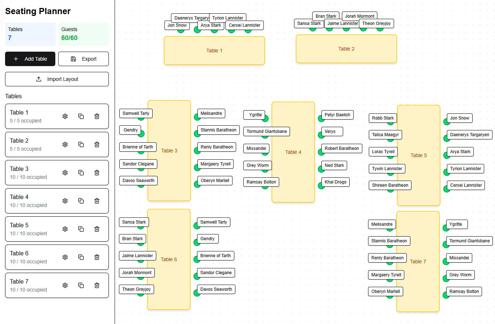

# Seating Planner

**Seating Planner** is a visual, drag-and-drop application for organizing guests around tables—perfect for events like weddings, banquets, or conferences. Designed to be intuitive and responsive, the app allows users to configure tables, assign guests to specific seats, and export/import seating layouts.

## Features

- 🪑 Create, configure, and position tables dynamically
- 👤 Assign guest names to individual seats
- 🔁 Swap or move guests between seats with drag-and-drop
- 💾 Export and import layouts as JSON files
- 📦 Responsive UI with modern design using TailwindCSS and ShadCN UI components

## Demo



## Getting Started

### Prerequisites

- Node.js (>= 18)
- pnpm or npm

### Installation

```bash
git clone https://github.com/0x10-z/Seating-Planner
cd seating-planner
pnpm install
```

### Run locally

```bash
pnpm dev
```

Then open [http://localhost:3000](http://localhost:3000) in your browser.

## Tech Stack

- **React** & **Next.js**
- **TailwindCSS** + **ShadCN UI**
- **Lucide Icons**
- **TypeScript**

## Planned Features

- Table templates (round, rectangular, etc.)
- Guest list import from CSV
- Print-friendly export
- Support for groups and table constraints (e.g., max capacity)

## License

MIT License. See [`LICENSE`](./LICENSE) for more information.
